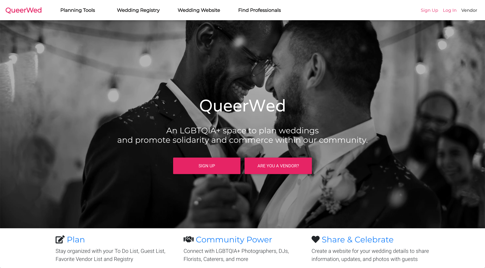

# QueerWed

## An LGBTQIA+ space to plan weddings and promote solidarity and commerce within our community.

## About the Website:

 <strong> Plan: </strong>Stay organized with your To Do List, Guest List, Favorite Vendor List and Registry

 <strong> Community Power: </strong>Connect with LGBTQIA+ Photographers, DJs, Florists, Caterers, and more

 <strong> Share & Celebrate: </strong> Create a website for your wedding details to share information, updates, and photos with guests
 
 

## Couples Sign Up

- Click the "Sign Up" button. Answer a few questions about your big day. Use your email address and password to log into your account.

## Vendor Sign Up

- Click the "Are You A Vendor" button. If you meet the requirements, complete the business form.
   
   

You can visit the site at:  
[https://queerwed.herokuapp.com](https://queerwed.herokuapp.com/)

